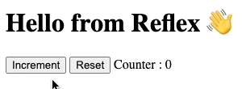

<div style="text-align: center">
	<h1>Reflex</h1>
</div>	

__Reflex__ is a tiny and fast reactive UI library.

- 🦋 Super lightweight and **0 dependency**, about  min-zipped
- 🏎 Highly performant diffing algorithm
- 🔋 Batteries included with **factory extensions**
- ⚛️ Truly reactive, states are Signals by design
- 🔍 Fine grained DOM updates for even better performances, components are rendered only when needed
- 🤓 Typed JSX
- 🍰 Easy to learn
- 🤘️ HMR Support for Vite
- 🚀 Super fast hydration support

[](http://npm.im/reflex-dom)

<br>


<br>
[](https://unpkg.com/reflex-dom/dist/reflex.es2022.min.js)
[](https://unpkg.com/reflex-dom/dist/reflex.es2022.min.js)

---

## Quick example

```shell
# Install with npm
npm i reflex-dom
```

```typescript jsx
import { h, render, state } from 'reflex-dom';
export function App (props) {
  // State management
  const counter = state(0);
  const increment = () => counter.value ++;
  const reset = () => counter.value = 0;
  // Components returns a render function
  return () => <div>
    <h1>Hello from {props.name} 👋</h1>
    <button onClick={increment}>Increment</button>&nbsp;
    <button onClick={reset}>Reset</button>&nbsp;
    <span>Counter : {counter}</span>
  </div>
}
render( <App name="Reflex" />, document.body );
```



---

## [🎮 - Play with this example on StackBlitz](https://stackblitz.com/edit/node-freprp?file=index.tsx)
## [👨‍🏫 - Learn Reflex in 5 minutes](https://zouloux.github.io/reflex/learn/)
## [📘 - See API documentation](https://zouloux.github.io/reflex/api/)
