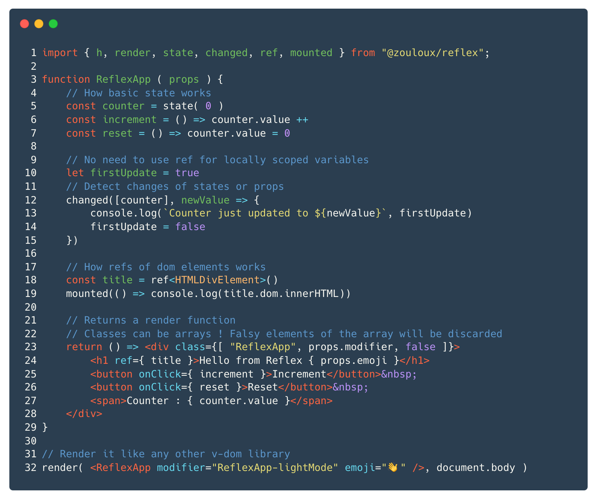
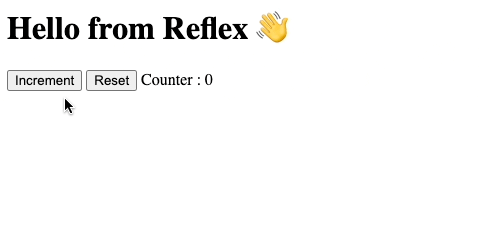

# Reflex

__Reflex__ is a tiny and fast virtual-dom UI lib with __factory based functional components__.

- 🦋 Super lightweight and __0 dependency__, about  min-zipped
- 🏎 Highly performant ( [Proof](#performances) )
- 🔋 Batteries included with [factory extensions](#factory-extensions)
- 🤓 Typed JSX
- 🍰 Easy to learn
- 🤘️ HMR Support for Vite

[](http://npm.im/@zouloux/reflex)


<br>
[](https://unpkg.com/@zouloux/reflex/dist/reflex.es2017.min.js)
[](https://esm.sh/v89/@zouloux/reflex/es2022/reflex.bundle.js)

---

[//]: # (Carbon source)
[//]: # (https://carbon.now.sh/?bg=rgba%28255%2C255%2C255%2C1%29&t=lucario&wt=none&l=text%2Ftypescript-jsx&width=830&ds=false&dsyoff=20px&dsblur=68px&wc=true&wa=false&pv=12px&ph=13px&ln=true&fl=1&fm=Hack&fs=14px&lh=133%25&si=false&es=2x&wm=false&code=import%2520%257B%2520h%252C%2520render%252C%2520state%252C%2520changed%252C%2520ref%252C%2520mounted%2520%257D%2520from%2520%2522%2540zouloux%252Freflex%2522%253B%250A%250Afunction%2520ReflexApp%2520%28%2520props%2520%29%2520%257B%250A%2509%252F%252F%2520How%2520basic%2520state%2520works%250A%2509const%2520counter%2520%253D%2520state%28%25200%2520%29%250A%2509const%2520increment%2520%253D%2520%28%29%2520%253D%253E%2520counter.value%2520%252B%252B%250A%2509const%2520reset%2520%253D%2520%28%29%2520%253D%253E%2520counter.value%2520%253D%25200%250A%250A%2509%252F%252F%2520No%2520need%2520to%2520use%2520ref%2520for%2520locally%2520scoped%2520variables%250A%2509let%2520firstUpdate%2520%253D%2520true%250A%2509%252F%252F%2520Detect%2520changes%2520of%2520states%2520or%2520props%250A%2509changed%28%255Bcounter%255D%252C%2520newValue%2520%253D%253E%2520%257B%250A%2509%2509console.log%28%2560Counter%2520just%2520updated%2520to%2520%2524%257BnewValue%257D%2560%252C%2520firstUpdate%29%250A%2509%2509firstUpdate%2520%253D%2520false%250A%2509%257D%29%250A%250A%2509%252F%252F%2520How%2520refs%2520of%2520dom%2520elements%2520works%250A%2509const%2520title%2520%253D%2520ref%253CHTMLDivElement%253E%28%29%250A%2509mounted%28%28%29%2520%253D%253E%2520console.log%28title.dom.innerHTML%29%29%250A%250A%2509%252F%252F%2520Returns%2520a%2520render%2520function%250A%2509%252F%252F%2520Classes%2520can%2520be%2520arrays%2520%21%2520Falsy%2520elements%2520of%2520the%2520array%2520will%2520be%2520discarded%250A%2509return%2520%28%29%2520%253D%253E%2520%253Cdiv%2520class%253D%257B%255B%2520%2522ReflexApp%2522%252C%2520props.modifier%252C%2520false%2520%255D%257D%253E%250A%2509%2509%253Ch1%2520ref%253D%257B%2520title%2520%257D%253EHello%2520from%2520Reflex%2520%257B%2520props.emoji%2520%257D%253C%252Fh1%253E%250A%2509%2509%253Cbutton%2520onClick%253D%257B%2520increment%2520%257D%253EIncrement%253C%252Fbutton%253E%2526nbsp%253B%250A%2509%2509%253Cbutton%2520onClick%253D%257B%2520reset%2520%257D%253EReset%253C%252Fbutton%253E%2526nbsp%253B%250A%2509%2509%253Cspan%253ECounter%2520%253A%2520%257B%2520counter.value%2520%257D%253C%252Fspan%253E%250A%2509%253C%252Fdiv%253E%250A%257D%250A%250A%252F%252F%2520Render%2520it%2520like%2520any%2520other%2520v-dom%2520library%250Arender%28%2520%253CReflexApp%2520modifier%253D%2522ReflexApp-lightMode%2522%2520emoji%253D%2522%25F0%259F%2591%258B%2522%2520%252F%253E%252C%2520document.body%2520%29)



[→ Play with this example on CodeSandbox](https://codesandbox.io/s/reflex-example-9v6pgl?file=/src/index.tsx)

---

## API Concept

> Stateful components will return a __render function__ instead of virtual-nodes directly.
> Scope is shared between the factory and the render function.

```tsx
function StatefulComponent ( props ) {
    // Factory extensions and component logic goes here ( factory phase )
    // This part is only executed once, when component is created.
    const number = state( 0 )
    // ...
    // Render function returning node tree goes there ( in a function )
    return () => <div>Current number is { number }</div>
}
```

> Reflex uses the same functional component for stateless than React and Preact.

```tsx
function StatelessComponent ( props ) {
	// No need for factory function here
	return <div>Hello { props.name }</div>
}
```

#### Improvements 👍
- __Simpler__ : Classic React Hooks like `useCallback`, `useEvent` and `useMemo` becomes __useless__ and does not exist in __Reflex__.<br>
- __Fewer bugs__ : [Stale closure issues](https://dmitripavlutin.com/react-hooks-stale-closures/) vanishes.<br>
- __Cleaner__ : Also, hooks dependencies array to keep state scopes ([#1](https://itnext.io/how-to-work-with-intervals-in-react-hooks-f29892d650f2), [#2](https://overreacted.io/a-complete-guide-to-useeffect/)) are not needed with __[factory extensions](#factory-extensions)__.
- __Back to basics__ : Using `useRef` to store stateless values does not exist anymore. In __Reflex__, `ref` is used only to target dom node or components, `let` is used to declare local variables like it would normally do.

#### Tradeoffs 👎
- __Stateless vs stateful__ : When a component is going from stateless to stateful, the `return <div>...` needs to be refactored to `return () => <div>...`. But stateless components **can** be implemented with factory function.
- __Props__ : Props cannot be destructured in the factory phase [because props is mutated](#props)
- Surely more but I got biases :)

---

### [→ See online documentation](https://zouloux.github.io/reflex/)