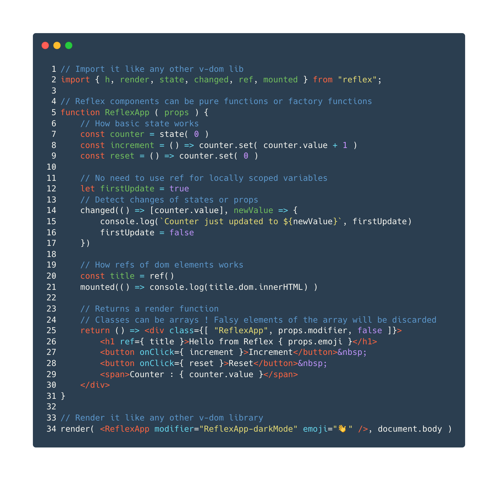

# Reflex

__Reflex__ is a tiny and fast virtual-dom library with __factory based functional components__.

- 🦋 Super lightweight - about  min-zipped - [See bundle](https://unpkg.com/@zouloux/reflex)
- 🏎 Highly performant - [Proof](#performances)
- 🔋 Batteries included with [factory extensions](#factory-extensions)
- 🤓 Typed JSX




[//]: # (Carbon source)
[//]: # (https://carbon.now.sh/?bg=rgba%28255%2C255%2C255%2C1%29&t=lucario&wt=none&l=text%2Ftypescript-jsx&width=680&ds=false&dsyoff=20px&dsblur=68px&wc=true&wa=true&pv=56px&ph=56px&ln=true&fl=1&fm=Hack&fs=14px&lh=133%25&si=false&es=2x&wm=false&code=%252F%252F%2520Import%2520it%2520like%2520any%2520other%2520v-dom%2520lib%250Aimport%2520%257B%2520h%252C%2520render%252C%2520state%252C%2520changed%252C%2520ref%252C%2520mounted%2520%257D%2520from%2520%2522reflex%2522%253B%250A%250A%252F%252F%2520Reflex%2520components%2520can%2520be%2520pure%2520functions%2520or%2520factory%2520functions%250Afunction%2520ReflexApp%2520%28%2520props%2520%29%2520%257B%250A%2509%252F%252F%2520How%2520basic%2520state%2520works%250A%2509const%2520counter%2520%253D%2520state%28%25200%2520%29%250A%2509const%2520increment%2520%253D%2520%28%29%2520%253D%253E%2520counter.set%28%2520counter.value%2520%252B%25201%2520%29%250A%2509const%2520reset%2520%253D%2520%28%29%2520%253D%253E%2520counter.set%28%25200%2520%29%250A%250A%2509%252F%252F%2520No%2520need%2520to%2520use%2520ref%2520for%2520locally%2520scoped%2520variables%250A%2509let%2520firstUpdate%2520%253D%2520true%250A%2509%252F%252F%2520Detect%2520changes%2520of%2520states%2520or%2520props%250A%2509changed%28%28%29%2520%253D%253E%2520%255Bcounter.value%255D%252C%2520newValue%2520%253D%253E%2520%257B%250A%2509%2509console.log%28%2560Counter%2520just%2520updated%2520to%2520%2524%257BnewValue%257D%2560%252C%2520firstUpdate%29%250A%2509%2509firstUpdate%2520%253D%2520false%250A%2509%257D%29%250A%250A%2509%252F%252F%2520How%2520refs%2520of%2520dom%2520elements%2520works%250A%2509const%2520title%2520%253D%2520ref%28%29%250A%2509mounted%28%28%29%2520%253D%253E%2520console.log%28title.dom.innerHTML%29%2520%29%250A%250A%2509%252F%252F%2520Returns%2520a%2520render%2520function%250A%2509%252F%252F%2520Classes%2520can%2520be%2520arrays%2520%21%2520Falsy%2520elements%2520of%2520the%2520array%2520will%2520be%2520discarded%250A%2509return%2520%28%29%2520%253D%253E%2520%253Cdiv%2520class%253D%257B%255B%2520%2522ReflexApp%2522%252C%2520props.modifier%252C%2520false%2520%255D%257D%253E%250A%2509%2509%253Ch1%2520ref%253D%257B%2520title%2520%257D%253EHello%2520from%2520Reflex%2520%257B%2520props.emoji%2520%257D%253C%252Fh1%253E%250A%2509%2509%253Cbutton%2520onClick%253D%257B%2520increment%2520%257D%253EIncrement%253C%252Fbutton%253E%2526nbsp%253B%250A%2509%2509%253Cbutton%2520onClick%253D%257B%2520reset%2520%257D%253EReset%253C%252Fbutton%253E%2526nbsp%253B%250A%2509%2509%253Cspan%253ECounter%2520%253A%2520%257B%2520counter.value%2520%257D%253C%252Fspan%253E%250A%2509%253C%252Fdiv%253E%250A%257D%250A%250A%252F%252F%2520Render%2520it%2520like%2520any%2520other%2520v-dom%2520library%250Arender%28%2520%253CReflexApp%2520modifier%253D%2522ReflexApp-darkMode%2522%2520emoji%253D%2522%25F0%259F%2591%258B%2522%2520%252F%253E%252C%2520document.body%2520%29)

- [See this example running](https://zouloux.github.io/reflex/example/example.html)
- [See more complex demos](https://zouloux.github.io/reflex/demos/)

---

## API Concept

Stateful components will return a __render function__ instead of virtual-nodes directly.
Scope is shared between the factory and the render function.

```tsx
function FactoryComponent ( props ) {
    // factory extensions and component logic goes here
    // render function returning node tree goes there
    return () => <div>...</div>
}
```

#### Improvements 
- __Simpler__ : Classic React Hooks like `useCallback`, `useEvent` and `useMemo` becomes useless.<br>
- __Less bugs__ : [Stale closure issues](https://dmitripavlutin.com/react-hooks-stale-closures/) vanishes.<br>
- __Cleaner__ : Also, hooks dependencies array to keep state scopes ([#1](https://itnext.io/how-to-work-with-intervals-in-react-hooks-f29892d650f2) [#2](https://overreacted.io/a-complete-guide-to-useeffect/)) does not exist with __[factory extensions](#factory-extensions)__.
- __Back to basics__ : Using `useRef` to store stateless values does not exist anymore. In __Reflex__, `ref` are only here to target dom node or components, `let` is used to declare local variables like it would normally do.

#### Tradeoffs
- __Stateless vs stateful__ : When a component is going from stateless to stateful, the `return <div>...` needs to be refactored to `return () => <div>...`
- __Props__ : Props cannot be destructured [because props are a Proxy](#props)
- Surely more but I got biases :)

---

## Table of contents

- <a href="#how-to-install">Installation</a>
- <a href="#because-code-samples-are-better-than-a-thousand-words">Code samples</a>
  - <a href="#simple-dom-rendering">Rendering</a>
  - <a href="#stateless-and-pure-components">Stateless</a>
  - <a href="#stateful-components-with-factory-pattern">Stateful and Factory Pattern</a>
  - <a href="#props">Props</a>
  - <a href="#default-props">Default props</a>
- <a href="#factory-extensions">Factory extensions</a>
  - <a href="#state">State</a>
  - <a href="#ref">Ref</a>
  - <a href="#refs-aka-multi-ref">Refs</a>
  - <a href="#mounted-and-unmounted">Mounted & Unmounted</a>
  - <a href="#changed">Changed</a>
- <a href="#more">More</a>
  - <a href="#automatic-forwardref">Automatic forwardRef</a>
  - <a href="#css-classes-as-array">CSS classes as array</a>
- <a href="#about">About</a>
  - <a href="#things-missing">Things missing</a>
  - <a href="#performances">Performances</a>
  - <a href="#demos">Demos</a>
  - <a href="#unpkg-and-esmsh">Unpkg and Esmsh</a>
  - <a href="#roadmap">Roadmap</a>
  - <a href="#thanks">Thanks</a>

## How to install

Install it with `npm i @zouloux/reflex`.

#### With typescript 
You will need at least those options into `tsconfig.json` :
```json
{
    "compilerOptions": {
        "jsxFactory": "h",
        "jsx": "react"
    }
}
```

#### With babel
```
{
  "presets": [
    [
      "@babel/preset-react",
      { "runtime": "automatic" }
    ]
  ],
  "plugins": [
    [
      "@babel/plugin-transform-react-jsx",
      { "pragma" : "h" }
    ]
  ]
}
```

## Because code samples are better than a thousand words

### Simple DOM rendering

```tsx
// Import Reflex like you would import Preact for example.
import { h, render } from "reflex";

function renderApp( greetings:string ) {
  const app = <div class="MyApp">
    <h1>{ greetings }</h1>
  </div>
  render( app, document.body )
}

renderApp( `Hello from Reflex ✌️` )
// Note : if you call renderApp again, it will update state of previously rendered app
// renderApp( `Dom is updated` )
```

### Stateless and pure components

Stateless, or components without logic can avoid the factory pattern. Simply return the virtual-dom tree derived from props like you would do it in React or Preact.
Stateless functions are [__pure__](https://en.wikipedia.org/wiki/Pure_function), which means it has always the same output (returned elements) for a specific input (props).
```tsx
function StatelessComponent ( props ) {
    return <div class="StatelessComponent">
      Hello { props.name } 👋
    </div>
}
```

> Because Stateless and Stateful components are written differently, Reflex can  optimize render of Stateless components by keeping old virtual-node tree, if props did not change between renders. We have better performances without adding anything to our app.
> No need to memoize anything.

```tsx
function ChangingComponent ( props ) {
  // If "connectedUser.name" does not changes between "ChangingComponent" renders,
  // "StatelessComponent" does not need to re-render.
  return () => <div>
    ...
    <StatelessComponent name={ connectedUser.name } />
  </div>
}
```

### Stateful components with factory pattern

This is where it changes from React. Stateful components in Reflex follows the __Factory Component Pattern__. __[Factory extensions](#factory-extensions)__ are used __only__ in the "factory phase" of the component.

```tsx
function StatefulComponent ( props ) {
    // This is the "factory phase"
    // This part of the component is executed once, when component is created and not updated.
    
    // Create a state for this component, like in React or Solid 
    const currentNumber = state( 0 )
    const incrementNumber = () => currentNumber.set( currentNumber.value + 1 )
    
    // The component needs to return a function which will render the component
    return () => <div class="StatefulComponent">
        {/* Update state when button is clicked */}
        <button onClick={ incrementNumber }>
            Click to increment current number: {currentNumber.value}
        </button>
    </div>
}
```

> Stateful components are not __pure__. Output differs even with the same props as input.

### Props

In Stateful components, "props" is a __Proxy__ object (like in Solid). Because factory phase is executed once, at component's creation, we need a way to access new props values at each render, this is possible thanks to __Proxy__ [#1](https://developer.mozilla.org/en/docs/Web/JavaScript/Reference/Global_Objects/Proxy), [#2](https://caniuse.com/?search=proxy).

```tsx
function PropsComponent ( props ) {
    function logName () {
        // ✅ Will log latest name, even if component rendered several times
        console.log( props.name )
    }
    return () => <div>
        <button onClick={ logName }>Log name</button>
    </div>
}
```

> The main tradeoff is that props destructuring is not possible anymore. Or destructed props will be equal to the first props value and will never change.

```tsx
function PropsComponent ( props )  {
    // 🚫 Here name will never change even if the component is updated by its parent
    const { name } = props
    function logName () {
        console.log( name )
    }
    return () => <div></div>
}
```

### Default props

Default props are configurable in factory and pure functional components.

```tsx
function PureComponent (props, component) {
    component.defaultProps = {	
        title: "Default title"
    }
    console.log("Render", props.title)
    return <div>{ props.title }</div>
}
function FactoryComponent (props, component) {
    component.defaultProps = {
        title: "Default title"
    }
    console.log("Factory", props.title)
    return () => <div>{ props.title }</div>
}
```
> This feature is WIP and may change in RC

# Factory extensions

Here is a list of all base __factory extensions__ available.
Remember, __factory extensions__ are only usable in __factory phase__ of components and not available in Stateless components.
Like in React, __factory extensions__ are composable into other functions easily.

## State

```tsx
// Create a new state
const myState = state( initialState )

// Get current state value
console.log( myState.value )

// Set new value (will trigger a component update)
myState.value = newValue
// -> Dom not updated yet

// After setting using .value, component is not refreshed instantanously
// Use .set to wait for component invalidation
await myState.set( newValue )
// -> Now the dom is updated
```

> __Note__ : setting a new state is asynchronous because all state changes of a component are stacked and component renders only once for better performances.
> After the component is refreshed, the `await state.set( value )` promise will be resolved.

Additional options for state are 
- `filter` to change value when set, useful to avoid invalid values
- `directInvalidation` is called after the associated component is rendered

```typescript
const myState = state( 0, {
	// Value is filtered when "myState.value = something" or "myState.set( something )" is used. 
    // Here value cannot be set bellow 0 
    filter: (newValue, oldValue) => Math.max( newValue, 0 ),
    // Will force component to be rendered after each set
    // It can be useful if you need sync data rendering
    // But be careful about data flow, it can destroy performances in loops !
    directInvalidation: true
})

// Value is 0 and DOM is directly updated
myState.value = -2

// Because of directInvalidation, it will render component at each loop and your app will certainly crash
for ( let i = 0; i < 10000; ++i)
	myState.value ++
```

## Ref

Like in React, we can use ref to target rendered components.

```tsx
function MyComponent () {
    // Create a new ref
    const otherComponentRef = ref()
  
    function showref () {
        // Log component dom element
        console.log('DOM', otherComponentRef.dom )
      
        // Log component instance
        console.log('Component', otherComponentRef.component )
    }
    
    return () => <div>
        <OtherComponent ref={ otherComponentRef }/>
        <button onClick={ showref }>Show ref</button>
    </div>
}
```

> The main difference with React is that ref are useless to create locally scoped component variables.

To create a locally scoped prop that will not trigger rendering, just use `let`

```tsx
function MyComponent () {
    // Create a local variable (no need for ref here)
    let localVariable = 0
  
    function updateLocalVariable () {
        // Update this variable will not trigger a render
        localVariable ++
        console.log( localVariable );
    }
    
    return () => <div>
        <button onClick={ updateLocalVariable }>Update local variable</button>
    </div>
}
```

## Refs aka multi-ref

Multi ref in Reflex is `ref` as an array of components. Very handy when dealing with lists!

```tsx
function List ( props ) {
    // Create ref for list
    const itemRefs = refs()
  
    function showListItemElements () {
        // Will be an array of all refs
        console.log( itemsRefs.list );
    }
    
    return () => <ul>
        {props.items.map( item =>
            <li ref={ itemRefs }>{item.name}</li>
        )}
    </ul>
}
```

> Refs are populated in order of rendering. So if you are using a list which can render in another order than from 0 to length, you can specify the index ( [see example](./demos/common/CodeViewer/CodeViewer.tsx) )

```tsx
function List ( props ) {
    const itemRefs = refs()
    return () => <ul>
        {props.items.map( (item, i) =>
            // Here item.ready can render elements in the wrong order
            // refs.atIndex( index ) will force index and patch this issue 
            item.ready && <li ref={ itemRefs.atIndex(i) }>{item.name}</li>
        )}
    </ul>
}
```


## Mounted and unmounted

Pretty self-explanatory, will be called when mounting or unmounting the component. 

```tsx
function MountUnmount ( props ) {
    const root = ref()
    
    mounted(() => {
        console.log("Component just mounted, refs are ready.", root.dom)
        // Can return an unmount function
        return () => {
            console.log("Will be called just before component unmount.", root.dom)
        }
    })
    
    unmounted( () => {
        console.log("Will be called just before component unmount.", root.dom)
    })
    
    return () => <div ref={ root }>...</div>
}
```

## Changed

__Changed__ factory hook is useful to detect changes into a component.  With only one handler as argument, it will be called after each component render.

```tsx
function ChangedComponent ( props ) {
    const root = ref()
    const number = state(0)
    changed(() => {
        // Called after each render
        // Ref and state are available
        console.log("Component updated", root.dom, number.value)
    })
    return () => <div ref={ root }>
        <button onClick={ e => number.value ++ }>
            Update component
        </button>
    </div>
}
```

__Changed__ can have a first argument to detect changes on values. Because we are in __Factory phase__, raw props or values can't be used directly. __Note__ that the check function __always returns an array__.

```tsx
function ChangedComponent ( props ) {
    const stateA = state()
    const stateB = state()
    changed(
        // The function detect changes only on stateA, stateB is ignored
        () => [stateA.value],
        // Called when change is detected
        () => {
            // StateA is updated
            console.log(stateA.value)
        }
    )
    return () => <div>...</div>
}
```

Return from the detect function can detect changes on multiple elements.

```tsx
function ChangedComponent ( props ) {
    const stateA = state()
    const stateB = state()
    changed(
        // The function detect changes in stateA and props.name, stateB is ignored
        () => [stateA.value, props.name],
        // Called when change is detected in stateA OR props.name
        // Both new state and old state values are concatenated into arguments
        //      new array       |        old array      //
        (newStateA, newPropsName, oldStateA, oldPropsName) => {
            // Values array here are the last and previous returned array
            // Useful to detect changes, or pub-sub any other component or model
            console.log( newStateA, newPropsName, oldStateA, oldPropsName )
        }
    )
    return () => <div>...</div>
}
```

__Changed__ handler has the same return behavior than `mount` and `unmount`.

```tsx
function ChangedComponent ( props ) {
    const state = state()
    changed( () => [state.value], newValue => {
        // After change and at first render
        console.log("New value", newValue)
        return oldValue => {
            // Before change and before unmount
            console.log("Old value", oldValue)
        }
    })
    return () => <div>...</div>
}
```

## More

Reflex is slim, but it still has some cool features for greater DX.

### Automatic forwardRef

When attaching a ref from inside the component, an from the parent, it will just work as expected.

```tsx
function Child () {
    // Works, will have component instance and div element
    const root = ref()
    return () => <div ref={ root }></div>
}
function Parent () {
    // Also works without forwardRef
    // will have component instance and div element
    const child = ref()
    return () => <div>
      <Child ref={ child } />
    </div>
}
```
> This feature is WIP and will certainly change in RC

### CSS classes as array

CSS classes can be set as an array. Falsy values will be automatically filtered out.

```tsx
function PureComponent ( props ) {
    const classes = [
        "PureComponent",
        props.modifier ? `PureComponent-${props.modifier}` : null,
        props.disabled && "disabled",
        ...props.classes
    ]
  return <div class={ classes }></div>
}
// Will have class="PureComponent PureComponent-big ParentComponent_pureComponent"
// Disabled is filtered out because props.disabled is not defined
const component = <PureComponent
  modifier="big"
  classes={["ParentComponent_pureComponent"]}
/>
```

## About

### History

Reflex idea comes from 2018 when React proposed [React Hooks](https://github.com/reactjs/rfcs/pull/68).
After digging hooks for some months, a [lot of people](https://github.com/zouloux/prehook-proof-of-concept/issues/1) talked about the benefits of having a __Factory Phase__ with a render function returned instead of all in one function.
[I proposed a proof of concept of a factory component system](https://github.com/zouloux/prehook-proof-of-concept) based on [Preact](https://github.com/preactjs/preact).
Years after using React hooks (with Preact a lot), I finally had time to get this idea working into a standalone lib ✨

### Things missing

Here is the list of things missing from React :
- React suspense (loading fallback) - is planned
- renderToString - is planned
- React fiber and asynchronous rendering - not planned
- Class components - not planned
- A lot of other stuff

Things missing from Solid :
- Crazy performances thanks to compiling - not planned
- A lot of other stuff

Things missing from Preact :
- Not so much I guess?

### Atomic rendering

Reflex will implement atomic rendering for states. Which means that when a state changes, not all the component is diffed, but only the affected dom nodes.
See Jason Miller post : https://twitter.com/_developit/status/1549001036802625536
This feature is WIP

### Performances

Reflex goal is to be __as performant as possible__ and __as light as possible__.
Reflex will never be as performant than [Solid](https://github.com/solidjs) (because of the Virtual DOM bottleneck), but targets to be more performant than Preact and React in a lot of cases.
Library weight will be around `3kb gzipped`. It may be a bit more if we add some useful features. Not used features can be tree-shaken if you use a bundler (like Parcel or Vite).
[See note](./CODEGOLF.md) about code golfing.


For now Reflex performances are between petit-dom and Preact. It can be greatly improved since Reflex is still in beta!

About size, see [Reflex bundle](https://unpkg.com/@zouloux/reflex) vs [Preact bundle](https://unpkg.com/preact) (without states)

### Demos

[Click here](https://zouloux.github.io/reflex/demos/) to see some demo (WIP)


### Unpkg and Esmsh

__Reflex__ is available on [Unpkg](https://unpkg.com/@zouloux/reflex) 
- [see unpkg usage example](https://zouloux.github.io/reflex/demos/5-no-bundler-demo/index.html)

Also available on Esm.sh
- [Esm.sh](https://esm.sh/@zouloux/reflex)

> Its better to specify used version in your code to avoid code breaking and also for cache and response time.

## Roadmap

#### Done
- [x] A lot of research about how v-dom works
- [x] Actual Virtual dom implementation
- [x] Diffing with complex trees
- [x] Props as dom attributes
- [x] Lifecycle events
- [x] Lifecycle extensions (mounted / unmounted)
- [x] Ref
- [x] Refs
- [x] State
- [x] Automatic memo
- [x] Better performances
  - [x] Diff algorithm inspired by [petit-dom](https://github.com/yelouafi/petit-dom/) and Preact
  - [x] Props as proxy only if needed (not on functional components)
- [x] SVG support
- [x] renderToString
- [x] JSX Types and runtime
- [x] State invalidation refacto

#### Work in progress / TODO
- [ ] WIP - New `changed` API which can listen to `states`, `props` and custom handlers with simple API
- [ ] WIP - Imperative handles through component instance
- [ ] WIP - Shared ref between parent and child + component ref + refacto component interface for refs and public API
- [ ] WIP - Atomic rendering
- [ ] Crazy performances
- [ ] Hydration
- [ ] Web components integration
- [ ] `npm create reflex-app`
- [ ] Server components streaming
- [ ] Better docs
  - [ ] Should update
  - [ ] Render to string doc
  - [ ] Imperative methods
  - [ ] Forward refs and component ref
  - [ ] Memo on functional components and shouldUpdate
  - [ ] New states
  - [ ] Babel examples in doc
  - [ ] Code-sandboxes
- [ ] Release : Move everything to a Reflex organisation

#### Next, other subjects

- [ ] Reflex store (compatible with Preact and React)
- [ ] Reflex router (compatible with Preact and React)
- [ ] Reflex Run with SSR ?
- [ ] Reflex UIKit ?


### Thanks

- [xdev1](https://github.com/xdev1) for your feedbacks 🙌 ( and the name of Factory Extensions )
- [Preact](https://github.com/preactjs/preact) for the inspiration and some chunk of codes
- [Jason Miller](https://github.com/developit), [Marvin Hagemeister](https://github.com/marvinhagemeister), [Dan Abramov](https://github.com/gaearon), [Sophie Alpert](https://github.com/sophiebits) for your amazing ideas 🙏
